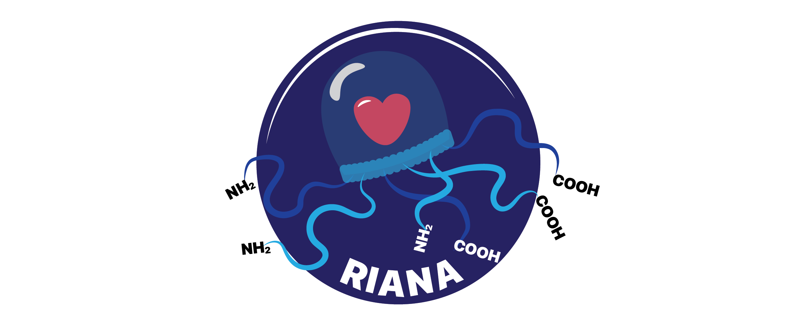
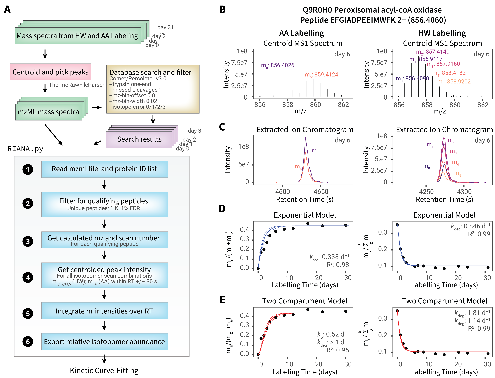

- [Edward Lau Lab](https://laulab.net), University of Colorado School of Medicine
- [Maggie Lam Lab](https://maggielab.org), University of Colorado School of Medicine

## About RIANA

RIANA (**R**elative **I**sotope **A**bundance A**na**lyzer) is a software to automate the analysis of mass spectrometry-
based protein turnover measurement experiments.

RIANA quantifies protein turnover from metabolic **heavy water (D~2~O)** labeling experiments. The MS1 isotopomer
integration is label-agnostic, while kinetic fitting is currently D~2~O-only (^18^O support is in progress; the earlier
amino-acid / SILAC fitting path was retired in 1.0.0).

RIANA is orchestration-agnostic: peptide identification is owned upstream by established tools (**quantms** for DDA,
**DIA-NN** for DIA), and RIANA is a linear `integrate → fit → rollup` pipeline — MS1 peak integration, per-peptidoform
kinetic fitting, and protein-level roll-up with optional cross-condition turnover (Δk) testing. Both a command-line
interface and a desktop GUI (`riana gui`) are provided.

## Downloads

::: {.column-margin}
**Latest Updates**

v1.0.0
--
* Major rewrite: typed streaming pipeline, apex-window peak detection, IsoSpec forward-model fractional synthesis.
* New `riana rollup` for protein-level turnover + a cross-condition Δk test (`--model "linear simple"`).
* SDRF + manifest project workflow; quantms mzTab (DDA) and DIA-NN parquet (DIA) intake; gated match-between-runs (`--mbr`).
* New PySide6 desktop GUI: `riana gui`.

v0.9.0
--
* Stabilization release; mass-tolerance now means ±N ppm.

> See [Change Log](change.qmd) for details.

:::
The latest version and source code of RIANA can be found on github: <https://github.com/ed-lau/riana>.

See the [Quick Start](install.qmd) and [Documentation](about.qmd) for instructions.

## Contributors
* Edward Lau, PhD - [ed-lau](https://github.com/ed-lau)
* Maggie Lam, PhD - [Maggie-Lam](https://github.com/Maggie-Lam)
* Jordan Currie, MSc - [jordancurrie](https://github.com/jordancurrie)

## Citations

If you use RIANA or the associated methods in your research, please consider citing the following papers:

Original publication, heavy water and SILAC comparison:

1. **Harmonizing Labeling and Analytical Strategies to Obtain Protein Turnover Rates in Intact Adult animals**
Hammond DE, Simpson DM, Franco C, Wright Muelas M, Wasters J, Ludwig RW, PRescott MC, Hurst JL, Beynon RJ, E Lau *Molecular & Cellular Proteomics* 2022, 100252 [doi:10.1016/j.mcpro.2022.100252](https://doi.org/10.1016/j.mcpro.2022.100252) Epub 2022 May 28. PMID: 35636728; PMCID: PMC9249856.

Rule-based mass isotopomer selection method for heavy water:

2. **Improved Method to Determine Protein Turnover Rates with Heavy Water Labeling by Mass Isotopomer Ratio Selection**
Currie J, Ng DCM, Pandi B, Black A, Manda V, Durham C, Pavelka J, Lam MPY, Lau E.  *Journal of Proteome Research* 2025 Apr 4;24(4):1992-2005. [doi: 10.1021/acs.jproteome.4c01012](https://doi.org/10.1021/acs.jproteome.4c01012) Epub 2025 Mar 18. PMID: 40100644; PMCID: PMC11977540.

Application of heavy water labeling to cell culture:

3. **Deuterium Labeling Enables Proteome Wide Turnover Kinetics Analysis in Cell Culture**
Alamillo L, Ng DCM, Currie J, Black A, Pandi B, Manda V, Pavelka J, Schaal P, Travers JG, McKinsey TA, Lam MPY, Lau E.  *Cell Rep Methods* 2025 Jul 21;5(7):101104. [doi: 10.1016/j.crmeth.2025.101104]((https://doi.org/10.1016/j.crmeth.2025.101104)). Epub 2025 Jul 10. PMID: 40645189; PMCID: PMC12296481.